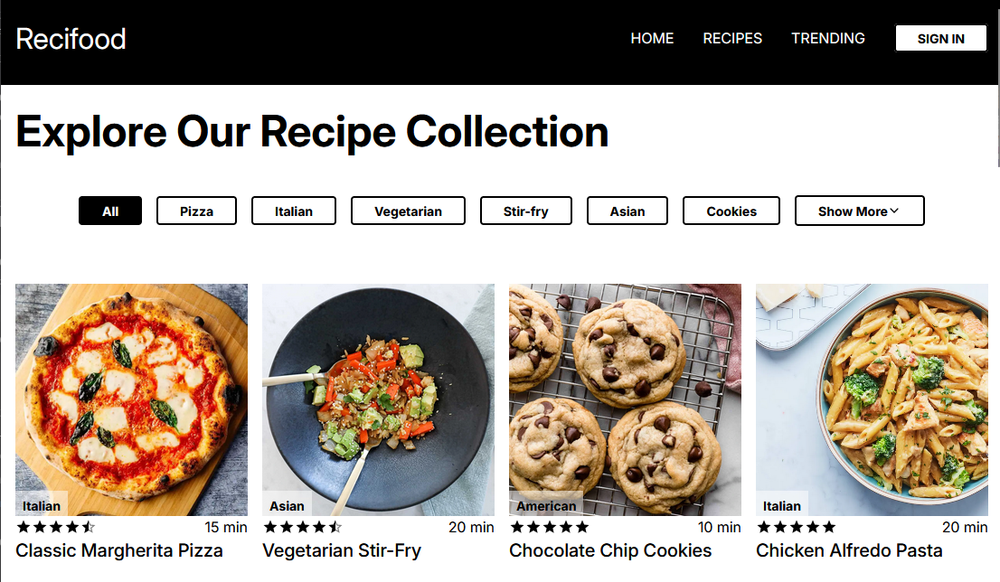
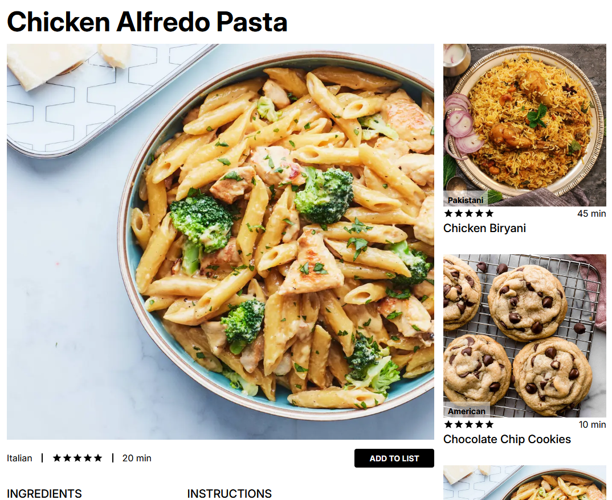

# Readme

This codebase provides a convenient way to browse and save recipes

## Local install

1. Install [Node Package Manager](https://www.npmjs.com/) 

2. Create a [MongoDB](https://www.mongodb.com/) cluster

3. Clone this repository to a location of your choice

4. Run `npm install` and `cp .env.example .env` in your cloned repository

5. Put your MongoDB database user credentials in the .env file

6. Run `npm run dev`

7. App will be available at [localhost:3000](localhost:3000)

## Created by Artemis and Terra
